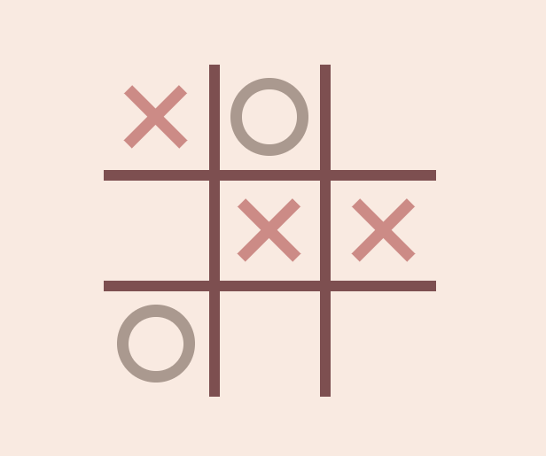
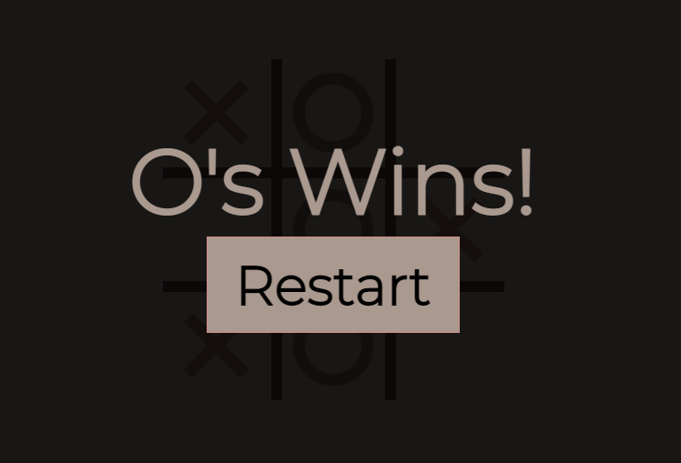
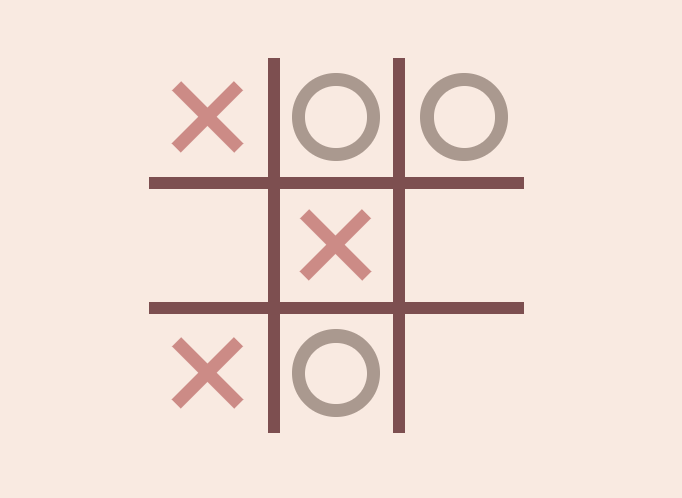

# Tic Tac Toe Game Clone
## Description
 

  This project is a basic clone of the common "Tic Tac Toe" game using JavaScript, HTML, CSS. Below show the user interface of the game.

  
  
  

 

### Dependencies

* HTML5, CSS, JavaScript (version 1.5)
* Windows 11

### Installing

* Find the code <a href="https://github.com/NzyC/Tic-Tac-Toe">here!</a>
## Help & Contact

Any advice for common problems or issues email me <a href="mailto:nidal.chowdhury1@gmail.com">here!</a>

## Authors

Contributors names and contact info

* Nidal Chowdhury  
<a href="https://www.linkedin.com/in/nidal-chowdhury-b56b52220/">
LinkedIn</a>
 
 <a href="https://github.com/NzyC">Github</a>

## Acknowledgments

Inspiration, code snippets, etc.
* Web Dev Simplified YT video on <a hre="https://www.youtube.com/watch?v=Y-GkMjUZsmM&ab_channel=WebDevSimplified">Basic JS Tic Tac Toe Game</a>